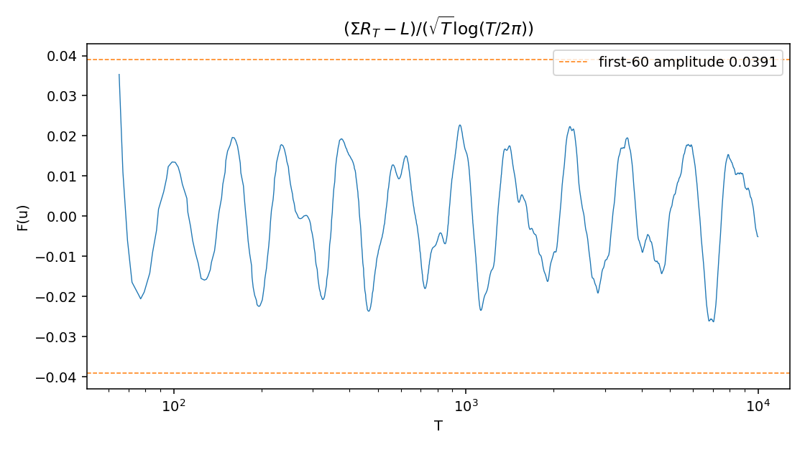

# ERi Zero Sums

**Open · Research manuscripts and numerical companion · September 2026**

Three manuscripts study the entire Gram function ERi, its sums over zeta and
Dirichlet L-function zeros, and a finite formula for real-character prime counts.
This repository contains the manuscripts, computation code, selected numerical
results and figure-generation scripts.

This is a research draft. The arguments have undergone source checks and
model-assisted audits; they have not been independently peer reviewed. Numerical
checks test the implementations, not the mathematical theorems. Novelty has not
been established by a complete literature search.

## Manuscripts

| Manuscript | Subject |
| --- | --- |
| [Zeta zero sums](manuscripts/zeta-zero-sums.md) | Oscillation, conditional Bohr expansion and failure of fixed real Riesz summation |
| [Real-character prime counts](manuscripts/real-character-prime-counts.md) | Finite Möbius inversion, parity constants and averaged prime-counting endpoints |
| [Dirichlet zero sums](manuscripts/dirichlet-zero-sums.md) | Zeta-driven oscillation in the untwisted ERi sum over Dirichlet zeros |

The two-sided oscillation and failure of fixed nonnegative real Riesz orders are
unconditional claims in the manuscripts. The Bohr expansion uses the Weak Mertens
Conjecture; the exact envelope and Bessel-product distribution also use linear
independence of positive zeta ordinates. See the
[notation sheet](docs/notation.md) and [research status](docs/research-status.md).

## Getting started

Use Python 3.11 or later. Run these commands from the repository root:

```shell
python -m venv .venv
```

Activate the environment on Windows PowerShell:

```powershell
.\.venv\Scripts\Activate.ps1
```

On macOS or Linux:

```shell
source .venv/bin/activate
```

Install the core dependencies and run the representative checks:

```shell
python -m pip install -r requirements-core.txt
python compute/quick_validate.py
python compute/check_regeneration.py
```

These checks cover evaluator branch switches, precision preservation, endpoint
centering, finite amplitude calculations, zero-list validation, staged pipeline
failures and cache provenance. They use the included data and temporary files.

For plots and the full numerical supplement:

```shell
python -m pip install -r requirements.txt
python compute/analyze.py
python compute/paperB_q4.py
```

The latter commands regenerate files under `data/`. PARI/GP is optional for the
included-data checks and required only to generate new Dirichlet zero lists.
The larger zeta runs require a separately obtained external input. Commands,
expected outputs and run costs are described in
[reproducing the results](docs/reproducing-results.md).

## Repository contents

```text
manuscripts/   Three research manuscripts
compute/       ERi evaluators, numerical experiments and validation checks
compute/gp/    PARI/GP recipes for the archived character-zero computations
data/          Selected zero lists, computed arrays, tables and figures
docs/          Notation, research status, reproduction guide and provenance
```

The release retains archived numerical results and labels their limitations.
Finite residue sums are partial amplitudes, not rigorous bounds for the infinite
conditional envelope. The zeta numerical centre remains a candidate; the
Dirichlet centre and transient coefficients are fitted quantities.
See [data provenance](docs/data-provenance.md) before interpreting the tables.



The dashed lines show a finite 60-residue amplitude, not a rigorous bound for
the full conditional envelope.

Third-party papers, downloaded discussion archives, raw Odlyzko zero tables,
defective zero lists, machine logs and internal task correspondence are not
included. External sources remain credited in the manuscripts and provenance
guide. `MANIFEST.json` records SHA-256 checksums of the packaged files.

## Citation and licensing

Use the author name **Open** when citing these drafts. GitHub citation metadata
is provided in [CITATION.cff](CITATION.cff); no journal publication or DOI is claimed.

Code and software documentation are licensed under [MIT](LICENSE).
The manuscripts, research notes and original numerical results and figures are
licensed under [CC BY 4.0](LICENSE-CONTENT.md). Third-party material and external
input data are outside these grants.
